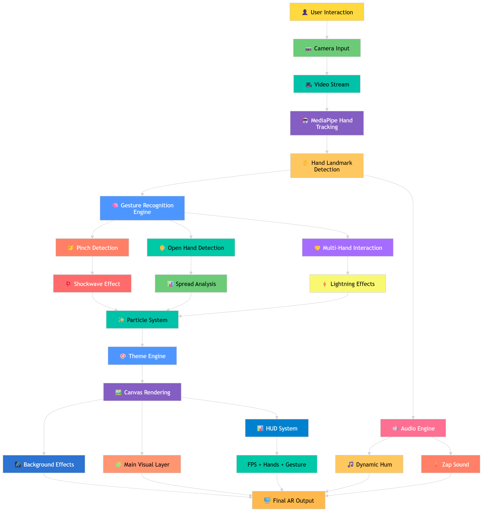

# ✨ Neon Aura AR - Hand Tracking Experience

<p align="center">
  🚀 <b>Real-Time Hand Tracking • Neon Effects • Interactive Audio</b>
</p>

---

## 🧠 Overview

**Neon Aura AR** is a browser-based interactive AR experience that uses real-time hand tracking to generate dynamic visual and audio effects.

Built using **MediaPipe Hands**, **Canvas API**, and **Web Audio API**, the system detects hand gestures and transforms them into immersive neon animations.

---

## 🏗️ Architecture

<p align="center">
  
</p>

---

## ⚙️ How It Works

1. 📷 Camera captures live video
2. 🤖 MediaPipe detects hand landmarks 
3. 🧠 Gesture engine identifies actions:

   * 🤏 Pinch → Shockwave
   * ✋ Open Hand → Spread
   * 🤝 Two Hands → Lightning
4. 🎨 Effects engine generates particles & visuals
5. 🔊 Audio engine adds dynamic sound
6. 🖼️ Canvas renders final AR output

---

## 🚀 Features

* ✋ Real-time Hand Tracking
* 🎨 Multiple Neon Themes
* 💥 Shockwave & Particle Effects
* ⚡ Multi-hand Lightning Interaction
* 🌌 Matrix Background Animation
* 🔊 Dynamic Audio Feedback
* 📊 HUD (FPS, Gesture, Hand Count)

---

## 🛠️ Tech Stack

* HTML5, CSS3, JavaScript
* MediaPipe Hands
* Canvas API
* Web Audio API

---

## 📂 Project Structure

```bash
Neon-Aura-AR/
│
├── index.html        # Main application
├── architecture.png # System diagram
└── README.md
```

---

## 🎮 Usage

1. Open `index.html`
2. Click **Enter Experience**
3. Allow camera access
4. Use your hands to interact

---

## 📸 Requirements

* Modern browser (Chrome recommended)
* Camera permission
* Internet connection (CDN)

---

## 💡 Future Scope

* Gesture-based UI controls
* Mobile optimization
* Custom themes

---

## 📜 License

Free to use for learning and projects

---
